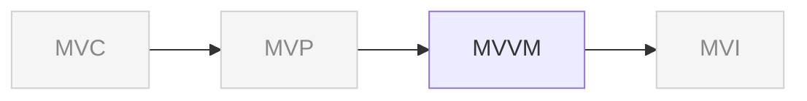

# Architecture란?

```mermaid  
flowchart LR  
MVC["MVC"] --> MVP["MVP"]  
MVP --> MVVM["MVVM"]  
MVVM --> MVI["MVI"]  
  
style MVC fill:#f5f5f5,stroke:#d0d0d0,color:#888  
style MVP fill:#f5f5f5,stroke:#d0d0d0,color:#888
style MVI fill:#f5f5f5,stroke:#d0d0d0,color:#888  
```

