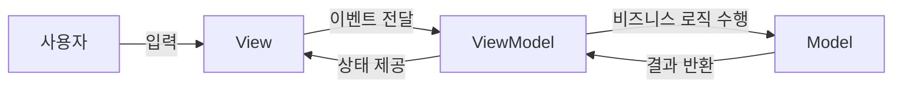
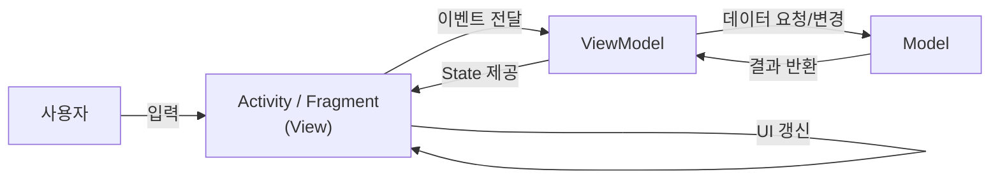
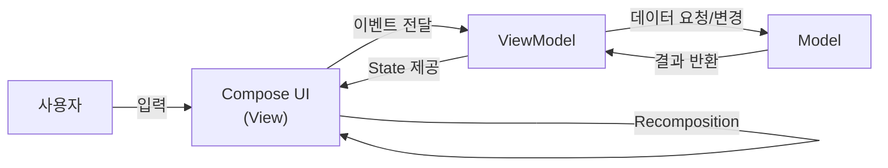
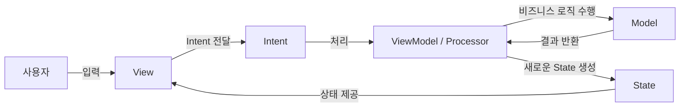
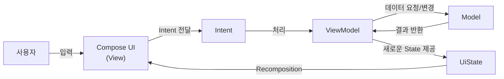

## MVW Architecture

MVW는 Model-View-Whatever의 약자로, Model과 View를 중심으로 각 구성 요소의 책임과 상호작용 방식을 정의하는 아키텍처 패턴들을 의미한다.

대표적인 MVW 패턴으로는 MVC, MVP, MVVM, MVI가 있다.

각 패턴은 모두 관심사 분리를 목표로 하지만,
책임을 분리하는 방식과 데이터 흐름에 차이가 있으며 각각 고유한 장단점을 가진다.

## MVC 이전

GUI 애플리케이션은 사용자 입력에 따라 데이터를 변경하고, 그 결과를 화면에 반영하는 과정을 반복한다.  
  
이러한 처리들이 하나의 클래스나 컴포넌트에 함께 작성되는 경우가 많았다.

상품 재고를 관리하는 간단한 예제를 살펴보자.

```kt
var stock = 10  
  
buyButton.setOnClickListener {  
	if (stock > 0) {  
		stock--  
		stockTextView.text = stock.toString()  
	} else {  
		showToast("재고가 없습니다.")  
	}  
}
```

위 코드에는 데이터(`stock`), 사용자 입력 처리(`setOnClickListener`), 그리고 비즈니스 규칙(재고 차감 및 재고 검증)이 모두 함께 존재한다.

이처럼 UI 코드와 비즈니스 로직의 결합성이 높으면, 애플리케이션 규모가 커질수록 유지보수와 테스트가 어려워진다.

이러한 문제를 해결하기 위해 데이터 관리, 화면 표현, 사용자 입력 처리의 책임을 분리하는 다양한 아키텍처가 등장하게 되었으며, 이를 통해 유지보수성과 재사용성을 높이고자 하였다.

## MVC

가장 먼저 등장한 대표적인 아키택처는 MVC이다.
MVC(Model-View-Controller)는 애플리케이션을 Model, View, Controller의 세 가지 구성요소로 나누어 각 요소의 책임을 분리하는 아키텍처 패턴이다.

### 구성 요소

- **Model**
	- 애플리케이션의 데이터와 비즈니스 로직을 담당한다.
- **View**
	- 사용자에게 화면(UI)을 보여주고 사용자 입력이 발생하는 영역이다.
- **Controller**
	- View로부터 전달받은 입력을 처리하고, Model을 변경하는 역할을 담당한다.

###  일반적인 데이터 흐름

일반적인 MVC는 다음과 같은 흐름으로 동작한다.

~~~mermaid
flowchart LR
    User["사용자"]
    View["View"]
    Controller["Controller"]
    Model["Model"]

    User -->|입력| View
    View -->|이벤트 전달| Controller
    Controller -->|비즈니스 로직 수행| Model
    Model -->|변경된 데이터| View
~~~

1. 사용자가 View를 통해 입력한다.
2. View는 입력을 Controller에게 전달한다.
3. Controller는 Model의 비즈니스 로직을 호출하여 데이터를 변경한다.
4. View는 변경된 Model의 상태를 화면에 반영한다.

즉, **Controller가 View와 Model 사이를 중재하는 역할**을 수행한다.

### Android에서의 MVC

Android에는 Controller라는 독립적인 컴포넌트가 존재하지 않는다.
따라서 일반적으로 다음과 같이 역할을 대응시킨다.

| MVC        | Android                |
| ---------- | ---------------------- |
| Model      | Model, Repository 등    |
| View       | XML 기반 UI(View System) |
| Controller | Activity / Fragment    |

Android에서 XML은 화면의 구조만 정의하며, 실제 사용자 입력 처리와 UI 갱신은 Activity(Fragment)가 담당한다

따라서 실제 데이터 흐름은 다음과 같이 이루어진다.

~~~mermaid
flowchart LR
    User["사용자"]
    Activity["Activity / Fragment<br/>(Controller)"]
    Model["Model"]
    View["XML(View)"]

    User -->|입력| Activity
    Activity -->|데이터 변경| Model
    Model -->|결과 반환| Activity
    Activity -->|UI 갱신| View
~~~

즉, Activity(Fragment)는 Controller의 역할 뿐만 아니라 View와 Model을 중재하고 UI를 직접 갱신하는 역할까지 수행하게 된다.

### 한계

MVC는 각 구정 요소의 책임을 분리하기 위해 등장했지만, Android에서는 Controller 역할을 Activity(Fragment)가 담당하게 된다.

문제는 Activity(Fragment)가 Controller의 역할뿐만 아니라 Android 컴포넌트가 수행해야 하는 역할까지 함께 담당한다는 점이다.

- 사용자 입력 처리: Controller 역할
- Model 호출: Controller 역할
- 화면(UI) 갱신: View를 직접 제어하는 역할
- 생명주기 관리: Android Framework
- 권한 요청: Android Framework
- 화면 전환: Android Framework

결과적으로 하나의 클래스에 여러 책임이 집중되면서 유지보수와 테스트가 어려워지고, 이를 Massive Activity 문제라고 한다.

이러한 문제를 해결하기 위해 화면 로직을 Activity로부터 분리하고, Controller의 화면 처리 책임을 별도의 Presenter에게 위임한 MVP(Model-View-Presenter)가 등장하게 된다.

### MVP

MVP(Model-View-Presenter)는 MVC에서 Controller가 담당하던 역할을 Presenter로 분리한 아키텍처 패턴이다.

### 구성 요소

- **Model**
	- 애플리케이션의 데이터와 비즈니스 로직을 담당한다.
- **View**
	- 사용자에게 화면(UI)을 보여주고, 사용자 입력을 Presenter에게 전달한다.
- **Presenter**
	- View로부터 전달받은 입력을 처리하고, Model을 호출한다.
	- Model의 결과를 View가 표시할 수 있는 형태로 전달한다.

### 일반적인 데이터 흐름

~~~mermaid
flowchart LR
	User["사용자"]
	View["View"]
	Presenter["Presenter"]
	Model["Model"]
	
	User -->|입력| View
	View -->|이벤트 전달| Presenter
	Presenter -->|비즈니스 로직 수행| Model
	Model -->|결과 반환| Presenter
	Presenter -->|UI 갱신 요청| View
~~~


1. 사용자가 View를 통해 입력한다.
2. View는 입력 이벤트를 Presenter에게 전달한다.
3. Presenter는 Model을 호출하여 비즈니스 로직을 수행한다.
4. Model은 처리 결과를 Presenter에게 반환한다.
5. Presenter는 View에게 화면 갱신을 요청한다.

흐름 자체만을 보면 Controller과 비슷하게 View와 Model 사이를 중재하는 역할을 한다.

### Android에서의 MVP

Android에서는 일반적으로 다음과 같은 역할을 대응시킨다.

| MVP       | Android             |
| --------- | ------------------- |
| Model     | Model, Repository 등 |
| View      | Activity / Fragment |
| Presenter | Presenter 클래스       |

MVC에서는 Activity(Fragment)가 Controller 역할과 UI 갱신 책임을 함께 담당하지만,
MVP에서는 Activity(Fragment)가 View 역할을 집중하고, 입력 처리와 화면 로직은 Presenter가 담당한다.

따라서 실제 데이터 흐름은 다음과 같이 이루어진다.

~~~mermaid

flowchart LR
	User["사용자"]
	View["Activity / Fragment<br/>(View)"]
	Presenter["Presenter"]
	Model["Model"]
	
	User -->|입력| View
	View -->|이벤트 전달| Presenter
	Presenter -->|데이터 요청/변경| Model
	Model -->|결과 반환| Presenter
	Presenter -->|UI 갱신 요청| View

~~~

이 구조에서는 Activity(Fragment)가 직접 Model을 호출하지 않고, Presenter에게 사용자 입력을 전달한다.
Presenter는 Model의 결과를 바탕으로 View에게 어떤 화면을 보여줄지 요청한다.

### 한계

MVP는 Activity(Fragment)의 책임을 줄여주지만, View와 Presenter가 서로 강하게 연결되는 구조를 가진다.

Presenter는 View 인터페이스를 알고 있고, View는 Presenter를 호출한다.  
화면이 복잡해질수록 Presenter에서 View에게 요청하는 메서드가 많아질 수 있다.

또한 Android에서는 Activity(Fragment)의 생명주기에 따라 Presenter와 View의 연결을 적절히 관리해야 한다.  
그렇지 않으면 이미 사라진 View를 Presenter가 참조하게 되어 메모리 누수나 잘못된 UI 갱신이 발생할 수 있다.

이러한 문제를 줄이기 위해 View가 직접 갱신 요청을 받는 방식이 아니라, View가 상태를 관찰하고 화면을 갱신하는 MVVM이 사용되기 시작했다.

## MVVM

MVVM(Model-View-ViewModel)는 View와 Model 사이에 ViewModel을 두어 화면에 필요한 상태와 화면 로직을 관리하는 아키텍처 패턴이다.

MVP에서는 Presenter가 View에게 직접 UI 갱신을 요청하는 반면 MVVM에서는 ViewModel이 화면 상태를 제공하고, View는 해당 상태를 관찰하여 스스로 화면을 갱신한다.

### 구성 요소

- **Model**
    - 애플리케이션의 데이터와 비즈니스 로직을 담당한다.
- **View**
    - 사용자에게 화면(UI)을 보여준다.
    - 사용자 입력을 ViewModel에게 전달한다.
    - ViewModel의 상태를 관찰하고 화면에 반영한다.
- **ViewModel**
    - 화면에 필요한 상태를 보관한다.
    - 사용자 입력에 따라 Model을 호출한다.
    - View가 관찰할 수 있는 상태를 제공한다.

### 일반적인 데이터 흐름

MVVM은 다음과 같은 흐름으로 동작한다.



1. 사용자가 View를 통해 입력한다.
2. View는 입력 이벤트를 ViewModel에게 전달한다.
3. ViewModel은 Model을 호출하여 비즈니스 로직을 수행한다.
4. Model은 처리 결과를 ViewModel에게 반환한다.
5. ViewModel은 변경된 상태를 View에게 제공한다.
6. View는 ViewModel의 상태를 관찰하고 화면을 갱신한다.

즉, **ViewModel은 View에게 직접 UI 갱신을 명령하지 않고, View가 사용할 상태를 제공한다.**

### Android에서의 MVVM

Android에서는 일반적으로 다음과 같이 역할을 대응시킨다.

| MVVM      | Android                                   |
| --------- | ----------------------------------------- |
| Model     | Model, Repository, UseCase 등              |
| View      | Activity / Fragment / XML 기반 UI / Compose |
| ViewModel | Jetpack ViewModel                         |

Android의 MVVM에서는 ViewModel이 화면 상태를 관리하고, Activity(Fragment) 또는 Compose UI가 이 상태를 관찰한다.

XML 기반 UI에서는 Activity(Fragment)가 ViewModel의 상태를 관찰한 뒤 직접 UI를 갱신한다.



반면 Jetpack Compose에서는 상태가 변경되면 Compose가 자동으로 UI를 다시 그린다.  
이 때문에 Compose는 상태 중심으로 동작하는 MVVM과 잘 맞는다.



### 한계

MVVM은 View와 ViewModel의 결합도를 낮추고, 화면 상태를 관리하기 쉽게 만들어준다.
하지만 화면이 복잡해질수록 ViewModel 내부에 많은 로직이 집중될 수 있다.
예를 들어 ViewModel은 다음과 같은 상태를 모두 관리하게 될 수 있다.

- 로딩 상태
- 성공 상태
- 에러 상태
- 입력값 상태
- 버튼 활성화 여부
- 일회성 이벤트
- 화면 이동 이벤트

상태 관리 기준이 명확하지 않으면 ViewModel이 비대해지고, 데이터 흐름을 추적하기 어려워질 수 있다.

또한 Toast, Dialog, Navigation과 같은 일회성 이벤트를 일반 상태와 함께 관리하면 화면 회전이나 상태 재수집 시 이벤트가 반복 실행될 수 있다.

이러한 문제를 줄이기 위해 사용자 입력을 명확한 Intent로 표현하고, 하나의 상태로 화면을 관리하는 MVI가 사용되기 시작했다.

## MVI

MVI(Model-View-Intent)는 사용자의 입력을 Intent로 표현하고 이를 처리하여 하나의 상태로 화면을 갱신하는 아키텍처 패턴이다.

MVI의 핵심은 **단방향 데이터 흐름**이다.

View에서 발생한 사용자 입력은 Intent로 전달되고, Intent를 처리한 결과는 새로운 State로 만들어진다.  
View는 State를 관찰하고, 해당 State에 따라 화면을 렌더링한다.

### 구성 요소

- **Model**
    - 화면의 상태를 의미한다.
    - 일반적으로 ViewState 또는 UiState로 표현한다.
- **View**
    - 사용자에게 화면(UI)을 보여준다.
    - 사용자 입력을 Intent로 변환하여 전달한다.
    - State를 관찰하고 화면을 렌더링한다.
- **Intent**
    - 사용자의 의도 또는 액션을 의미한다.
    - 버튼 클릭, 새로고침, 검색어 입력 등이 해당된다.

### 일반적인 데이터 흐름

MVI는 다음과 같은 흐름으로 동작한다.



1. 사용자가 View를 통해 입력한다.
2. View는 사용자 입력을 Intent로 변환하여 전달한다.
3. ViewModel 또는 Processor는 Intent를 처리한다.
4. 필요한 경우 Model을 호출하여 비즈니스 로직을 수행한다.
5. 처리 결과를 바탕으로 새로운 State를 만든다.
6. View는 State를 관찰하고 화면을 렌더링한다.

즉, **MVI는 입력과 상태 변화를 명확히 분리하고, 화면을 하나의 State로 표현한다.**

### Android에서의 MVI

Android에서는 일반적으로 다음과 같이 역할을 대응시킨다.

| MVI       | Android                       |
| --------- | ----------------------------- |
| Model     | UiState, State                |
| View      | Activity / Fragment / Compose |
| Intent    | UiIntent, UiEvent             |
| Processor | ViewModel                     |

MVI는 XML 기반 UI에서도 사용할 수 있지만, 상태를 기반으로 화면을 다시 그리는 Jetpack Compose와 특히 잘 맞는다.

Compose에서는 State가 변경되면 자동으로 Recomposition이 발생하기 때문에, View는 현재 State에 맞는 UI를 선언하면 된다.



예를 들어 사용자가 구매 버튼을 누르면 `BuyClicked`라는 Intent가 ViewModel로 전달된다.  
ViewModel은 이 Intent를 처리하여 재고를 감소시키거나, 재고가 없을 경우 에러 메시지가 포함된 새로운 State를 만든다.  
View는 새로운 State를 관찰하고 화면을 다시 렌더링한다.

### 한계

MVI는 데이터 흐름이 단방향이기 때문에 상태 변화를 추적하기 쉽고, 화면의 현재 상태를 명확하게 표현할 수 있다.

하지만 간단한 화면에서도 Intent, State, Reducer와 같은 구조를 정의해야 하므로 코드가 많아질 수 있다.

또한 모든 화면 상태를 하나의 State로 관리하기 때문에 State 설계를 잘못하면 오히려 ViewModel이 복잡해질 수 있다.

특히 Toast, Dialog, Navigation과 같은 일회성 이벤트는 주의해서 관리해야 한다.  
일회성 이벤트를 State에 그대로 포함하면 화면 회전이나 State 재수집 시 같은 이벤트가 다시 실행될 수 있다.

따라서 MVI에서는 지속적으로 유지되어야 하는 화면 상태와 한 번만 소비되어야 하는 이벤트를 구분해서 관리하는 것이 중요하다.