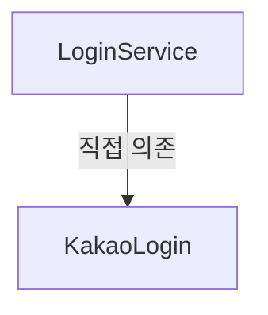
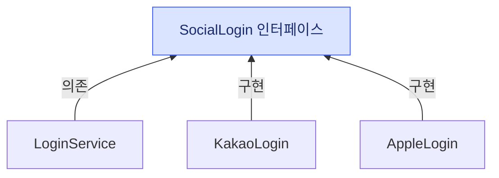

## 시작: 카카오 로그인만 있던 앱

이해를 돕기 위해 하나의 상황을 가정해보자.

어떤 안드로이드 앱을 처음 만들 때, 로그인은 카카오 하나면 충분했다고 하자.

그래서 로그인을 처리하는 `LoginService`가 `KakaoLogin`을 직접 생성해서 쓰도록 만들었다.

```kt
class LoginService {
    private val kakao = KakaoLogin()  // 직접 생성

    fun login() {
        kakao.authenticate()
    }
}
```

이 코드는 카카오 로그인만 쓸 때는 아무 문제가 없다. 잘 동작하고, 코드도 단순하다.

문제는 여기서부터 시작된다.


## 문제: 애플 출시, Apple 로그인을 추가해야 한다

그러던 어느 날, 이 앱을 iOS에도 출시하게 되었다고 하자.
그런데 애플 앱스토어 심사 정책상, 다른 소셜 로그인을 제공하는 앱은 **Apple 로그인도 함께 제공해야 한다.**

즉, 이제 `AppleLogin`을 추가해야 한다.

그런데 막상 추가하려고 보니, `LoginService`가 `KakaoLogin`을 **직접 생성해서 강하게 붙들고 있다.**

Apple 로그인을 끼워 넣으려면 결국 `LoginService` 내부를 이렇게 뜯어고쳐야 한다.

```kt
class LoginService(private val type: String) {
    private val kakao = KakaoLogin()
    private val apple = AppleLogin()  // 새로 추가

    fun login() {
        if (type == "kakao") {
            kakao.authenticate()
        } else if (type == "apple") {  // 분기 추가
            apple.authenticate()
        }
    }
}
```

로그인 수단이 하나 늘었을 뿐인데, `LoginService`가 `KakaoLogin`과 `AppleLogin` 두 구현을 모두 직접 알아야 하고, `if` 분기까지 떠안게 됐다.

이렇게 한 객체가 다른 객체의 구체 타입을 직접 알고, 직접 생성까지 책임지는 상태를 **결합도가 높다(tight coupling)** 고 한다.

결합도가 높으면 다음과 같은 문제가 생긴다.

- 로그인 수단을 추가할 때마다(구글, 네이버…) `LoginService` 코드를 계속 수정해야 한다.
- 테스트할 때 실제 소셜 인증 대신 가짜 객체(Mock)를 끼워 넣기 어렵다.
- `KakaoLogin`이나 `AppleLogin`의 변경이 `LoginService`에까지 영향을 준다.

즉, 서로 다른 객체들이 너무 강하게 묶여 있어서 **하나를 바꾸거나 추가하면 다른 하나도 함께 바꿔야 하는** 상태가 된 것이다.

이 결합도를 낮추기 위한 첫 번째 원칙이 DIP다.


## DIP (Dependency Inversion Principle)

DIP는 **의존관계 역전 원칙**으로, 핵심은 "구체적인 구현이 아니라 **추상화에 의존하자**"는 것이다.

다시 생각해보면, `LoginService`는 "소셜 로그인을 한다"는 행위만 필요할 뿐, 그것이 카카오인지 애플인지는 사실 알 필요가 없다.

그래서 "소셜 로그인을 한다"는 역할을 인터페이스(추상화)로 분리한다.

```kt
interface SocialLogin {
    fun authenticate()
}

class KakaoLogin : SocialLogin {
    override fun authenticate() { /* 카카오 인증 */ }
}

class AppleLogin : SocialLogin {
    override fun authenticate() { /* 애플 인증 */ }
}

class LoginService(
    private val social: SocialLogin  // 구현이 아닌 추상화에 의존
) {
    fun login() {
        social.authenticate()
    }
}
```

이제 `LoginService`는 `KakaoLogin`이나 `AppleLogin`이라는 구체 클래스를 몰라도 되고, `SocialLogin`이라는 인터페이스에만 의존한다. 아까와 달리 `if` 분기도, 구현체를 직접 생성하는 코드도 사라졌다.

나중에 구글·네이버 로그인을 추가하더라도 `SocialLogin`을 구현하는 클래스를 하나 더 만들면 될 뿐, `LoginService` 코드는 건드리지 않아도 된다.

여기서 "역전(Inversion)"이라는 단어가 붙은 이유는, 원래 상위 모듈(`LoginService`)이 하위 모듈(`KakaoLogin`)에 의존하던 방향이, **둘 다 추상화(`SocialLogin`)에 의존하는 형태로 방향이 뒤집혔기** 때문이다.

마지막 문장이 잘 와닿지 않아서, 조금 더 찾아보았다.

**변경 전**



**변경 후**



### 상위? 하위?

두 모듈 사이의 상대적 위치로 정책에 가까우면 상위, 세부 구현에 가까우면 하위이다.
(간단하게는 조금 더 넓은 범위를 상위라고 생각한다.)

- **`LoginService` = 상위 모듈** - "로그인을 한다"는 흐름을 지휘하는 고수준 정책
- **`KakaoLogin` = 하위 모듈** - 실제 카카오 인증을 처리하는 저수준 세부 구현

### "역전"의 진짜 의미 - 제어 흐름 vs 의존 방향

객체 사이에는 방향이 다른 두 가지가 있다.

- **제어 흐름** - 실행할 때 누가 누구를 호출하는가. `LoginService`가 `KakaoLogin.authenticate()`를 부른다. 이건 DIP를 적용하든 안 하든 **항상 그대로**다.
- **소스코드 의존** - 컴파일할 때 누가 누구를 알아야 하는가. **이것이 DIP로 뒤집히는 대상이다.**

변경 전에는 이 둘이 같은 방향이었다. 실행도 `LoginService → KakaoLogin`, 의존도 `LoginService → KakaoLogin`.

변경 후에는 제어 흐름은 그대로인데 의존 방향만 뒤집힌다.

```
실행:  LoginService ──호출──▶ KakaoLogin        (그대로)
의존:  LoginService ──▶ SocialLogin ◀── KakaoLogin
```

`KakaoLogin`은 실행할 땐 여전히 `LoginService`에게 **불려가는** 쪽인데, 소스코드에서는 자기가 `SocialLogin`을 향해 **의존하는** 쪽이 되었다. **실행 방향과 의존 방향이 반대가 된 것** — 이것이 "역전(Inversion)"이다.

쉽게 비유하면 **식당의 메뉴판**과 같다. 메뉴판이 없는 식당이 있다. 그리고 주방에는 한식·중식·양식 셰프가 따로 있다고 하자. 그럼 손님(`LoginService`)은 원하는 메뉴에 맞는 셰프를 직접 불러야 했다. "중식 메뉴 먹을 거니까 중식 셰프님 나와주세요"처럼, 손님이 주방에 누가 있는지까지 알고 지목해야 했던 셈이다.

하지만 이제 손님은 그냥 **메뉴판(`SocialLogin`)** 을 보고 주문만 하면 된다. 그러면 그 주문에 맞는 셰프(`KakaoLogin`, `AppleLogin`…)가 들어온 주문서를 보고 알아서 요리를 내온다. 손님은 누가 요리하는지 알 필요가 없고, 주방 쪽이 메뉴판이라는 규격에 맞춰 움직인다. **손님이 셰프를 직접 지목하던 관계가, 주방이 메뉴판에 맞춰 나서는 관계로 뒤집힌 것**이다.

그런데 여기서 한 가지 의문이 남는다. `LoginService`가 `SocialLogin` 추상화에 의존하는 것은 좋은데, 그렇다면 실제 `KakaoLogin`이나 `AppleLogin` 객체는 **누가, 어디서 넣어주는가?**

이 질문에 대한 답이 DI다.


## DI (Dependency Injection)

DI는 **의존성 주입**으로, "객체가 필요로 하는 의존성을 **내부에서 생성하지 말고, 외부에서 주입하자**"는 개념이다.

앞의 `LoginService`는 이미 생성자를 통해 `SocialLogin`을 받도록 되어 있다. 이 객체를 실제로 만들 때, 외부에서 어떤 구현체를 넣어줄지 결정한다.

```kt
val social = KakaoLogin()
val loginService = LoginService(social)  // 외부에서 주입
```

`LoginService`는 자기가 쓸 `SocialLogin`을 직접 만들지 않는다. 누군가 밖에서 만들어서 넣어준다.

이렇게 하면 상황에 따라 주입할 객체를 자유롭게 바꿀 수 있다.

```kt
// 카카오 로그인
val loginService = LoginService(KakaoLogin())

// 애플 로그인
val loginService = LoginService(AppleLogin())

// 테스트 환경
val loginService = LoginService(FakeLogin())
```

DI를 구현하는 방법은 크게 세 가지가 있다.

**1) 생성자 주입 (Constructor Injection)**
생성자를 통해 주입한다. 객체를 만들 때 필요한 의존성이 반드시 채워지고, `val`로 불변으로 둘 수 있어 **가장 권장되는 방식**이다.

```kt
class LoginService(
    private val social: SocialLogin  // 생성자로 주입
) {
    fun login() = social.authenticate()
}

val loginService = LoginService(KakaoLogin())
```

**2) 필드 주입 (Field Injection)**
필드에 직접 주입한다. 코드는 간결하지만, 객체 생성 후 주입 전까지는 값이 비어 있을 수 있고 테스트에서 갈아끼우기 어렵다.

```kt
class LoginService {
    lateinit var social: SocialLogin  // 필드에 직접 주입
    fun login() = social.authenticate()
}

val loginService = LoginService()
loginService.social = KakaoLogin()
```

**3) 메서드 주입 (Setter Injection)**
setter 메서드를 통해 주입한다. 생성 이후에 의존성을 바꿔 끼울 수 있다.

```kt
class LoginService {
    private lateinit var social: SocialLogin

    fun setSocialLogin(social: SocialLogin) {  // setter로 주입
        this.social = social
    }

    fun login() = social.authenticate()
}

val loginService = LoginService()
loginService.setSocialLogin(KakaoLogin())
```

DIP가 "추상화에 의존하라"는 **원칙**이라면, DI는 그 의존성을 실제로 **어떻게 연결할지에 대한 방법**이다.

그런데 객체가 많아지고 의존 관계가 복잡해지면, 이 "외부에서 주입하는" 코드를 매번 직접 작성하는 것이 부담스러워진다. `LoginService` 하나를 만들기 위해 `KakaoLogin`을 만들고, `KakaoLogin`이 또 다른 객체를 필요로 하면 그것도 만들어야 한다.

이 객체 생성과 주입의 책임을 개발자가 아닌 다른 주체가 대신 관리해주면 어떨까? 그것이 IoC다.


## IoC (Inversion of Control)

IoC는 **제어의 역전**으로, "**객체의 생성과 제어권을 개발자가 아니라 프레임워크가 관리한다**"는 개념이다.

기존에는 개발자가 직접 객체를 생성하고, 언제 어떤 객체를 넣을지 흐름을 제어했다.

```kt
val social = KakaoLogin()
val loginService = LoginService(social)
```

IoC에서는 이 제어권이 프레임워크로 넘어간다. 개발자는 "이 객체가 필요하다"고 선언만 하고, 실제로 객체를 만들어서 연결하는 일은 프레임워크(컨테이너)가 대신한다.

즉, **제어의 흐름이 개발자 → 프레임워크로 역전된다.**

- 개발자는 "무엇이 필요한지"만 선언한다.
- 프레임워크가 필요한 객체를 만들어서 적절한 곳에 주입한다.

이 차이를 코드로 보면 확실해진다. 아래는 안드로이드의 대표적인 DI 프레임워크인 Hilt를 쓴 예시다.

**변경 전**
개발자가 `new`(객체 생성)와 조립을 직접 한다.

```kt
val social = KakaoLogin()               // 직접 만들고
val loginService = LoginService(social) // 직접 끼워넣고
loginService.login()                    // 직접 실행
```

**변경 후**
개발자는 "무엇이 필요한지"만 애노테이션으로 선언하고, 생성·조립 코드는 사라진다.

```kt
// 구현체에 "주입해서 써도 되는 대상"이라고 표시만 해둔다
class KakaoLogin @Inject constructor() : SocialLogin {
    override fun authenticate() { /* 카카오 인증 */ }
}

// 필요한 의존성을 생성자에 "선언"만 한다. KakaoLogin()을 직접 만들지 않는다.
class LoginService @Inject constructor(
    private val social: SocialLogin
) {
    fun login() = social.authenticate()
}

// 개발자는 LoginService(...)를 직접 만들지 않는다.
// 프레임워크가 "SocialLogin이 필요하네 → KakaoLogin을 만들어 넣자"를
// 알아서 판단해 조립하고, 여기에 주입해준다.
@AndroidEntryPoint
class LoginActivity : AppCompatActivity() {
    @Inject lateinit var loginService: LoginService
}
```

`val loginService = LoginService(KakaoLogin())` 같은 **생성·조립 코드가 통째로 사라진 것**이 핵심이다. "언제 무엇을 만들어서 넣을지" 결정하는 제어권이 개발자에게서 프레임워크로 넘어갔기 때문이다.

DI는 IoC를 구현하는 대표적인 방식이다. 프레임워크가 객체의 생성과 생명주기를 관리하면서, 필요한 곳에 의존성을 자동으로 주입해주는 것이다.

이렇게 프레임워크가 객체의 생성과 제어를 관리해주는 대표적인 예가 Spring의 IoC 컨테이너이고, Android 진영에서는 Hilt 같은 DI 프레임워크가 같은 역할을 한다.


## Hilt

**Hilt는 안드로이드에서 DI를 쉽게 구현하도록 도와주는 구글이 공식적으로 권장하는 DI 라이브러리다.**
내부적으로 Dagger를 기반으로 하되 복잡한 설정을 줄여, 앞에서 본 것처럼 애노테이션(`@Inject`, `@AndroidEntryPoint` 등)만 붙이면 프레임워크가 의존성 그래프를 분석해 알아서 객체를 만들고 주입해준다.

안드로이드에서 특히 Hilt가 필요한 이유는 다음과 같다.

- **컴포넌트를 직접 생성할 수 없다.** `Activity`, `Fragment`, `ViewModel` 같은 안드로이드 컴포넌트는 개발자가 생성자를 호출해 만드는 게 아니라 **시스템(프레임워크)이 대신 생성**한다. 그래서 여기에 의존성을 넣어주기가 까다로운데, Hilt가 이 지점에 자동으로 주입해준다.
- **보일러플레이트가 줄어든다.** 수동 DI에서 필요한 팩토리·조립 코드 없이, 애노테이션만으로 의존성 연결이 끝난다.
- **생명주기에 맞춘 관리.** 객체를 앱 전체(`@Singleton`)나 화면 단위 등 원하는 범위에 맞춰 살아있게 관리할 수 있다.
- **테스트가 쉬워진다.** 실제 구현 대신 가짜 객체로 교체해 주입하기 편하다.


## 결론

결국 이 모든 개념은 **결합도를 낮추고, 로그인 수단이 늘어나도 유연하게 대응할 수 있으며, 테스트하기 쉬운 코드를 만들기 위한** 하나의 흐름으로 이어진다.
