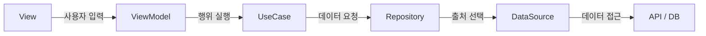

## Repository Pattern

앱에서 상품 목록을 보여주기 위해 서버에 데이터를 요청한다고 생각해보자.

아무것도 모르는 A씨는 `ViewModel`에서 API를 직접 호출하는 방식으로 구현을 하였다.

```kt
class ProductViewModel(
    private val productApi: ProductApi
) : ViewModel() {

    fun loadProducts() {
        viewModelScope.launch {
            val products = productApi.getProducts()
            // UI 상태 갱신
        }
    }
}
```

코드가 단순할 때는 큰 문제가 없어 보인다. 하지만 데이터가 서버뿐만 아니라 로컬 DB에서도 필요하거나, 네트워크 오류가 발생했을 때 저장된 데이터를 사용해야 한다면 `ViewModel`이 알아야 할 내용이 점점 많아진다.

- 데이터를 서버와 DB 중 어디에서 가져올 것인가?
- 서버에서 받은 데이터를 DB에 저장할 것인가?
- 네트워크 요청에 실패하면 어떻게 할 것인가?
- API 응답을 앱에서 사용하는 모델로 어떻게 변환할 것인가?

이러한 데이터 처리 책임을 `ViewModel`에서 분리하기 위해 Repository를 사용할 수 있다.


## Repository란 무엇인가

Repository는 애플리케이션에서 필요한 데이터를 제공하는 **데이터 접근 창구**이다.

데이터를 사용하는 쪽에서는 Repository에 필요한 데이터를 요청한다.
실제 데이터가 API에서 오는지, DB에서 오는지, 또는 캐시된 값인지는 알 필요가 없다.

```kt
interface ProductRepository {
    suspend fun getProducts(): List<Product>
}
```

`ViewModel`은 이제 `ProductApi` 대신 `ProductRepository`를 사용한다.

```kt
class ProductViewModel(
    private val productRepository: ProductRepository
) : ViewModel() {

    fun loadProducts() {
        viewModelScope.launch {
            val products = productRepository.getProducts()
            // UI 상태 갱신
        }
    }
}
```

Repository 구현체에서는 데이터를 실제로 어디에서 가져올지 결정한다.

```kt
class ProductRepositoryImpl(
    private val remoteDataSource: ProductRemoteDataSource,
    private val localDataSource: ProductLocalDataSource
) : ProductRepository {

    override suspend fun getProducts(): List<Product> {
        return try {
            val products = remoteDataSource.getProducts()
                .map { it.toDomain() }

            localDataSource.saveProducts(
                products.map { it.toEntity() }
            )
            products
        } catch (exception: Exception) {
            localDataSource.getProducts()
                .map { it.toDomain() }
        }
    }
}
```

서버 요청에 성공하면 새로운 데이터를 반환하고 로컬에 저장한다. 요청에 실패하면 로컬에 저장된 데이터를 반환한다.

이 과정이 Repository 안에 감춰져 있으므로 `ViewModel`은 데이터가 어디에서 왔는지 몰라도 된다.

캐시 사용 여부, 원격 요청 실패 시 로컬 데이터를 사용할지와 같은 것은 **데이터 제공 정책**이므로 Repository가 담당할 수 있다.

반면 품절 상품을 제외하는 것과 같은 비즈니스 규칙은 UseCase나 Domain에서, 가격을 30,000원으로 바꾸는 것과 같은 화면용 가공은 ViewModel 또는 UI 계층에서 담당하는 편이 각 책임을 구분하기 쉽다.

## Repository 주변의 구성요소

Repository와 함께 자주 등장하는 구성요소로 `DataSource`, `UseCase`, `ViewModel`이 있다.

### DataSource

DataSource는 API나 DB처럼 **특정 데이터 출처와 직접 통신**한다.

```kt
class ProductRemoteDataSource(
    private val productApi: ProductApi
) {
    suspend fun getProducts(): List<ProductResponse> {
        return productApi.getProducts()
    }
}
```

```kt
class ProductLocalDataSource(
    private val productDao: ProductDao
) {
    suspend fun getProducts(): List<ProductEntity> {
        return productDao.getProducts()
    }

    suspend fun saveProducts(products: List<ProductEntity>) {
        productDao.insertAll(products)
    }
}
```

DataSource와 Repository는 모두 데이터를 다루지만 책임은 다르다.

- DataSource는 API나 DB와 통신하며 **데이터를 어떻게 가져오고 저장할지** 안다.
- Repository는 여러 DataSource 중 **어떤 데이터를 제공할지** 결정한다.

예를 들어 Retrofit을 다른 네트워크 기술로 교체하거나 Room의 쿼리가 변경되는 것은 DataSource의 변화에 가깝다. 반면 서버 데이터를 언제 새로 요청할지, 실패했을 때 캐시를 사용할지와 같은 데이터 제공 정책은 Repository의 변화에 가깝다.

데이터 출처가 API 하나뿐이고 로직도 단순하다면 별도의 DataSource 없이 Repository가 API를 직접 사용할 수도 있다.

### UseCase

UseCase는 애플리케이션에서 사용자가 수행하는 **하나의 행위**를 표현한다.

상품 목록 중 판매 가능한 상품만 가격순으로 보여줘야 한다고 생각해보자.

```kt
class GetAvailableProductsUseCase(
    private val productRepository: ProductRepository
) {
    suspend operator fun invoke(): List<Product> {
        return productRepository.getProducts()
            .filter { it.stock > 0 }
            .sortedBy { it.price }
    }
}
```

Repository는 상품 데이터를 제공한다. UseCase는 그 데이터를 이용해 판매 가능한 상품 목록을 만든다.


### ViewModel

ViewModel은 화면에서 발생한 요청을 받아 UseCase를 실행하고, 그 결과를 화면 상태에 반영한다.

```kt
class ProductViewModel(
    private val getAvailableProducts: GetAvailableProductsUseCase
) : ViewModel() {

    fun loadProducts() {
        viewModelScope.launch {
            val products = getAvailableProducts()
            // 로딩, 성공, 실패 등의 UI 상태 갱신
        }
    }
}
```

책임을 나누고 나면 ViewModel은 데이터를 가져오는 방법이나 상품을 선별하는 규칙보다 화면 상태 관리에 집중할 수 있다.


## Domain과 모델

Domain은 애플리케이션이 해결하려는 **문제 영역**을 의미한다.

쇼핑 앱이라면 상품, 가격, 재고, 주문과 같은 개념과 그에 관련된 규칙이 Domain에 해당한다. Domain은 특정 라이브러리나 화면이 아니라 앱의 핵심 개념을 표현한다.

```kt
data class Product(
    val id: ProductId,
    val name: String,
    val price: Int,
    val stock: Int
)
```

여기서 `Product`는 앱이 이해하고 사용하는 Domain Model이다.

### Entity

Domain에서 Entity는 속성 일부가 변하더라도 **식별자가 같으면 동일한 대상**으로 보는 객체이다.

상품의 이름이나 가격이 변경되어도 `id`가 같다면 같은 상품이다.

```kt
// 가격은 달라졌지만 같은 id를 가진 동일한 상품
val before = Product(id = ProductId(1), name = "키보드", price = 30_000, stock = 3)
val after = Product(id = ProductId(1), name = "키보드", price = 25_000, stock = 3)
```

(Domain Entity와 Room의 `@Entity`는 다름.)


### Value Object

Value Object는 식별자가 아니라 **값 자체로 구분되는 객체**이다.

```kt
@JvmInline
value class ProductId(val value: Long)
```

`ProductId(1)`과 또 다른 `ProductId(1)`은 같은 값을 나타낸다. 금액, 수량, 이메일, 주소처럼 값의 의미와 규칙을 하나의 타입으로 표현할 때도 Value Object를 사용할 수 있다.


### DTO

DTO(Data Transfer Object)는 계층이나 시스템 사이에서 데이터를 전달하기 위한 객체이다.

```kt
data class ProductResponse(
    val productId: Long,
    val productName: String,
    val price: Int,
    val stock: Int
)
```

`ProductResponse`는 서버 응답 형식에 맞춰진 DTO이다. Repository에서는 이를 앱에서 사용하는 Domain Model로 변환한다.

```kt
fun ProductResponse.toDomain(): Product {
    return Product(
        id = ProductId(productId),
        name = productName,
        price = price,
        stock = stock
    )
}
```

화면에 `"30,000원"`처럼 가공된 값이 필요하다면 별도의 UI Model을 사용할 수도 있다.

```kt
data class ProductUiModel(
    val name: String,
    val priceText: String,
    val isSoldOut: Boolean
)
```

각 모델은 같은 상품을 표현하더라도 서로 다른 목적을 가진다.

```text
ProductResponse  →  Product  →  ProductUiModel
서버 응답 DTO        Domain       화면 표현
```

모든 프로젝트에서 모델을 반드시 세 종류로 나눠야 하는 것은 아니다. 외부 데이터 형식과 Domain 또는 화면의 요구사항이 서로 다르고, 한쪽의 변경이 다른 쪽에 미치는 영향을 줄여야 할 때 분리할 수 있다.


## 전체 흐름으로 이해하기

지금까지 살펴본 구성요소를 연결하면 다음과 같은 흐름이 만들어진다.



- ViewModel: 화면 상태 관리
- UseCase: 하나의 행위와 그에 필요한 비즈니스 규칙
- Repository: 데이터 출처를 감추고 어떤 데이터를 제공할지 결정
- DataSource: 특정 데이터 출처와 통신하는 기술적 세부사항 담당
- Domain Model: 앱의 핵심 개념 표현
